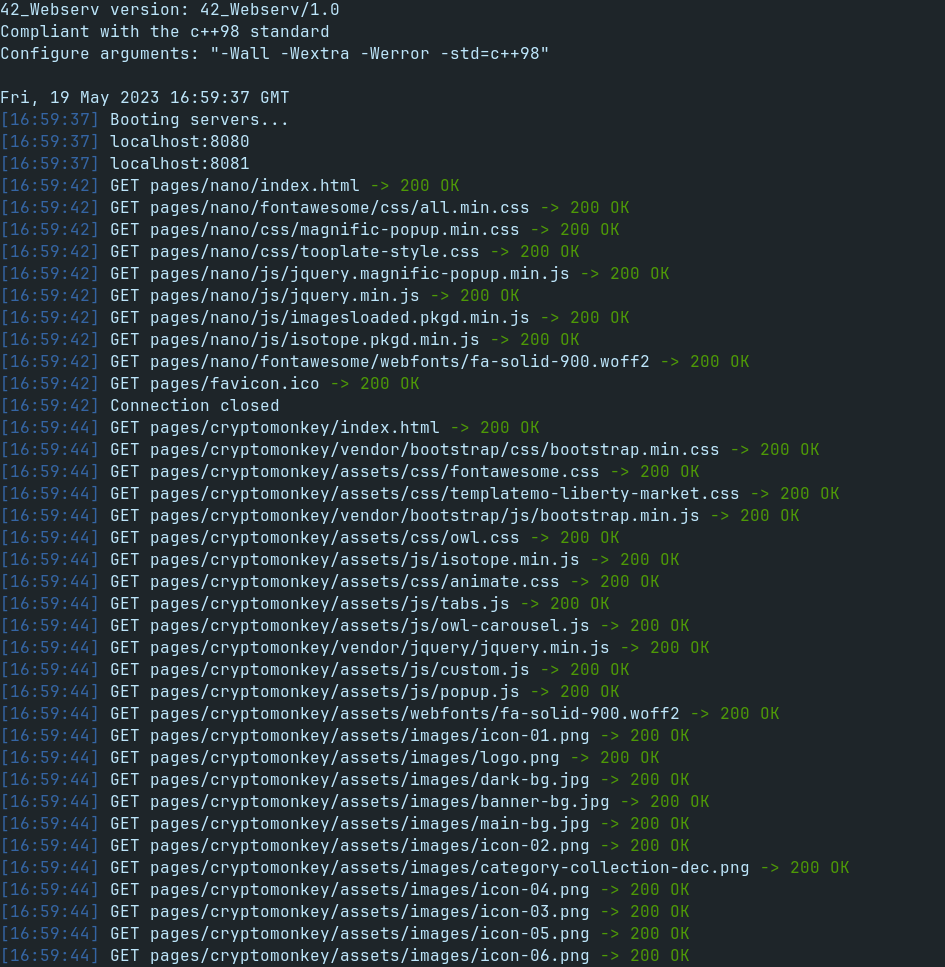

  <h1>
    Webserv
  </h1>
&nbsp;  

> The primary function of a web server is to store, process, and deliver web pages to
> clients. The communication between client and server takes place using the Hypertext Transfer Protocol (HTTP).

---

<h2 align=center>
	Description
</h2>

 
 Webserv is a web server that uses http protocol, written from scratch in C++ (C++98), capable of handling multiple servers, stress tests and uploads. 

 
> Disclaimer: Only tested on Firefox

Project done in collaboration with:  
- [Rodrigo Ramos](https://github.com/ramos21rodrigo)  
- [Nuno Carvalho](https://github.com/Kuninoto)  

---

<h2 align=center>
	Features
</h2>

- NGINX-like configuration file
- Handling of the **GET**, **POST** and **DELETE** HTTP request methods  
- File upload  
- Python CGI support   

<h2 align=center>
	How to run
</h2>

- Installing webserv dependencies:  

		sudo apt-get install c++ make  
- Clone this repository:  

		git clone https://github.com/RealMadnessWorld/Webserver
- Navigate to Webserv and run `make`

		cd Webserv/lvl_5_webserv
		make
- Run webserv

		./webserv <config_file>
		or
		./webserv
		which is the same as:
		./webserv config/default.conf

- Open Firefox and search for localhost:8080

###  Subject (v20.4): [webserv en_subject](./extras/en.subject_webserv.pdf)

<h4>
  Makefile commands:
</h4>

`make` or `make all` - compiles webserv  
`make clean` - wipes all object files  
`make fclean` - deletes webserv and all object files  
`make re` - fclean  + all  

---

	 

